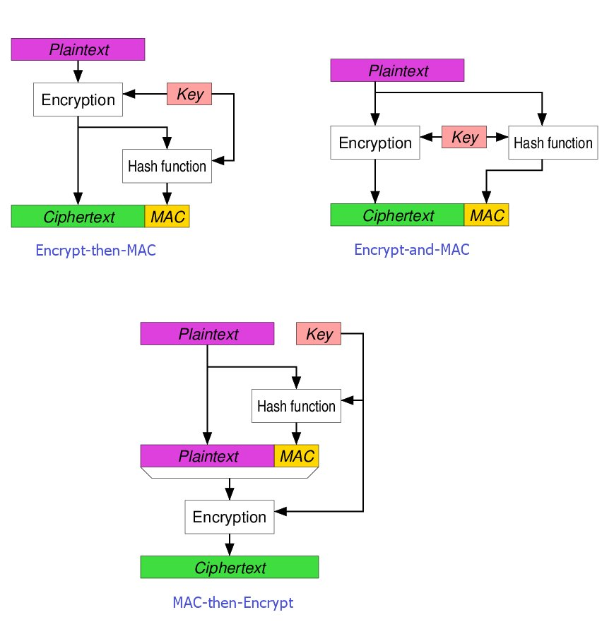

## AEAD Encryption with BQ Remote Functions

An implementation of [BQ AEAD Functions](https://cloud.google.com/bigquery/docs/reference/standard-sql/aead-encryption-concepts) as an external [Remote Function](https://cloud.google.com/bigquery/docs/reference/standard-sql/remote-functions) running as a Cloud Run Service.

So...why would you want to reimplement it as an external function again?

Well..theres really only one i can think of:  you want to keep the encryption key external to the query or parameter:

What i mean by that is that the signature of existing BQ AEAD functions requires you to submit the AEAD keyset in the query itself (either as a parameter or read in from a remote table):

BQ AEAD function here 

* `AEAD.ENCRYPT(keyset, plaintext, additional_data)`
* `AEAD.DECRYPT_BYTES(keyset, ciphertext, additional_data)`

...requires you to actually provide the keyset or reference to the keyset to do anything...

what if you don't want to? .. here you can save the BQ Key in a remote function where nobody has direct access to...that way you can encrypt and decrypt without distributing the AEAD key.  The keyset remains in "escrow" and only authorized by the service agent or service that the remote function runs as.

Since we are dealing with `TINK` keysets, you can also encrypt the raw keyset using KMS too

As for speed/cost comparison?  The BQ internal function is predictably _much_ faster...i scanned and encrypted 1M rows and it took _many times longer_ to do this with an external function...I also expect it to cost much more.

...but if you really don't want to supply the encryption/decryption key, it has to be held in escrow and processed remotely.



Also see

* [Google BigQuery Client-side AEAD Encryption](https://gist.github.com/salrashid123/7b6dd5f9d387acd0ec69d8c0992450d3)
* [BigQuery Client-side Encryption using AEAD](https://blog.salrashid.dev/articles/2022/bq_client_side_aead/)
* [Tink Authenticated Encryption with Associated Data (AEAD) ](https://developers.google.com/tink/aead)
* [Tink Samples](https://github.com/salrashid123/tink_samples)
* [Conditionally unmask columns in BigQuery using Authorized UDFs](https://medium.com/google-cloud/conditionally-unmasking-columns-in-bigquerys-using-authorized-udfs-f3a55a9665fb)
* [How can users prove a specific account has access to BigQuery? (AEAD encryption and authorized views)](https://stackoverflow.com/questions/56122855/how-can-users-prove-a-specific-account-has-access-to-bigquery-aead-encryption)

---

Anyway, if you want to test and deploy this yourself:


## Setup


```bash
export GCLOUD_USER=`gcloud config get-value core/account`
export PROJECT_ID=`gcloud config get-value core/project`
export PROJECT_NUMBER=`gcloud projects describe $PROJECT_ID --format='value(projectNumber)'`

bq mk --connection --display_name='myconn' --connection_type=CLOUD_RESOURCE \
        --project_id=$PROJECT_ID --location=US my-connection

bq show --location=US --connection  my-connection

export BQ_CONN_SVC_ACCOUNT=`bq show --format=json --location=US --connection  my-connection  | jq -r '.cloudResource.serviceAccountId'`
echo $BQ_CONN_SVC_ACCOUNT
```

## Load Keys as Secrets

We're going to load the AEAD encryption keys as environment variable based [Secrets](https://cloud.google.com/functions/docs/configuring/secrets).  

The encryption keys we will use here are [TINK keysets](https://developers.google.com/tink/design/keysets) that are compatible with default BQ `AEAD.*` functions.

We will use the keyset included in this repo but you are ofcourse free to define your own.


```bash
ce keysets/
gcloud secrets create keyset-1  --replication-policy="automatic"
gcloud secrets versions add keyset-1 --data-file=keyset2.json
```

Allow GCF's [default service account](https://cloud.google.com/functions/docs/2nd-gen/2nd-gen-differences) access to this secret

```bash
gcloud beta secrets add-iam-policy-binding keyset-1 \
  --member=serviceAccount:$PROJECT_NUMBER-compute@developer.gserviceaccount.com \
  --role=roles/secretmanager.secretAccessor -q
```

## Encrypt

Create an encryption function

```bash
cd encrypt

## set secrets is not supported yet in gen2
# gcloud beta functions deploy aead-encrypt  \
#    --gen2   --runtime go116  --entry-point AEAD_ENCRYPT \
#    --region=us-central1   --trigger-http \
#    --set-secrets 'KEYSET=keyset-1:latest' --no-allow-unauthenticated

## so we'll use cloud run

gcloud run deploy aead-encrypt \
   --source . \
   --set-secrets 'KEYSET=keyset-1:latest' \
   --no-allow-unauthenticated


export CLOUD_RUN_URL=`gcloud run services describe aead-encrypt --format="value(status.address.url)"`
echo $CLOUD_RUN_URL

gcloud run services add-iam-policy-binding aead-encrypt \
  --member="user:$GCLOUD_USER" \
  --role="roles/run.invoker"

gcloud run services add-iam-policy-binding aead-encrypt \
  --member="serviceAccount:$BQ_CONN_SVC_ACCOUNT" \
  --role="roles/run.invoker"

# wait a min until the policies propagate, then test locally
curl -s  -X POST  \
  -H "Authorization: Bearer `gcloud auth print-identity-token`" \
  -H "Content-Type: application/json"  \
  -d @req_encrypt.json \
  "$CLOUD_RUN_URL" | jq '.'

bq --format=json query --dataset_id=$PROJECT_ID:mydataset1 --location=US --nouse_legacy_sql  "
  CREATE OR REPLACE FUNCTION aead_encrypt(plaintext STRING, aad STRING) RETURNS STRING 
    REMOTE WITH CONNECTION \`$PROJECT_ID.us.my-connection\`
    OPTIONS (endpoint = '$CLOUD_RUN_URL',  user_defined_context = [('mode', 'encrypt')] );
"
```

## Decrypt 

Deploy the decrypt function

```bash
cd decrypt

# gcloud beta functions deploy aead-decrypt  \
#    --gen2   --runtime go116  --entry-point AEAD_DECRYPT \
#    --region=us-central1  --set-secrets 'KEYSET=keyset-1:latest' --trigger-http

gcloud run deploy aead-decrypt \
  --source . \
  --set-secrets 'KEYSET=keyset-1:latest' \
  --no-allow-unauthenticated

export CLOUD_RUN_URL=`gcloud run services describe aead-decrypt --format="value(status.address.url)"`
echo $CLOUD_RUN_URL

gcloud run services add-iam-policy-binding aead-decrypt \
  --member="user:$GCLOUD_USER" \
  --role="roles/run.invoker"

gcloud run services add-iam-policy-binding aead-decrypt \
  --member="serviceAccount:$BQ_CONN_SVC_ACCOUNT" \
  --role="roles/run.invoker"

# wait a min until the policies propagate, then test locally
curl -s  -X POST  \
  -H "Authorization: Bearer `gcloud auth print-identity-token`" \
  -H "Content-Type: application/json"  \
  -d @req_decrypt.json \
  "$CLOUD_RUN_URL" | jq '.'


bq --format=json query --dataset_id=$PROJECT_ID:mydataset1 --location=US --nouse_legacy_sql  "
  CREATE OR REPLACE FUNCTION aead_decrypt(ciphertext STRING, aad STRING) RETURNS STRING 
    REMOTE WITH CONNECTION \`$PROJECT_ID.us.my-connection\`
    OPTIONS (endpoint = '$CLOUD_RUN_URL',  user_defined_context = [('mode', 'decrypt'), ('max_batching_rows', '100')] )"
```

### TEST

Now lets test on an interesting public dataset that tells you what types of booze people in iowa buy:

```
Table ID  bigquery-public-data.iowa_liquor_sales.sales 
Table size  6.28 GB 
Number of rows 23,774,991 
```

#### Test BQ Built-in function `AEAD.ENCRYPT(data)`

Test the baseline/default BQ encryption function

```bash
bq  query \
--parameter=keyset1::CMKIrNYJEmQKWAowdHlwZS5nb29nbGVhcGlzLmNvbS9nb29nbGUuY3J5cHRvLnRpbmsuQWVzR2NtS2V5EiIaIGNoYW5nZSB0aGlzIHBhc3N3b3JkIHRvIGEgc2VjcmV0GAEQARjCiKzWCSAB \
--use_legacy_sql=false  'SELECT
  ecd1.item_description as item_description,
  AEAD.ENCRYPT(FROM_BASE64(@keyset1),
   ecd1.item_description,
   "somedata"
 )
FROM bigquery-public-data.iowa_liquor_sales.sales  AS ecd1
LIMIT 5;'

+-----------------------------+----------------------------------------------------------------------------------+
|      item_description       |                                       f0_                                        |
+-----------------------------+----------------------------------------------------------------------------------+
| Laphroaig w/ Whiskey Stones | AZrLBEL/FIAopVtQMchn0GKx67pXzrxx9tlMXzpaeBhXiuEctl2jvlNtmbNnp5MFqaCJ/3vwXMtd2eyc |
| Dekuyper Grape Pucker       |         AZrLBELmNZ0r3In+shDDpzMidwAYSIC5dZFv52admsBUUTHfEQfp5e0fcMJiax58uXvsfeXq |
| Dekuyper Peachtree          |             AZrLBELmrQgpXxD7D0MHOHg2abWd44juGPDMJq4kkFt0ePRr03kyYDybYXg/8nYJ2MVm |
| Glenlivet 12 Yr Malt Scotch | AZrLBEJCXJaI1ViC9bgHmEIZ8bHcIqDgeHX9aGPfH4IJrVvWA63UkeqZTaNhswPd1CMBiUfBY0M3Gath |
| Saints N Sinners Apple Pie  | AZrLBEJXU+FF1e8+jFtaCwGVmQp03nA7r6wX/Qu4UocasU5/96EIwBA3njalhWyf7h3cENCYHjgz8mI= |
+-----------------------------+----------------------------------------------------------------------------------+
```

#### Test BQ External Function `mydataset1.aead_encrypt(data)`

Now encrypt some data with our new remote function

```bash
bq  query \
--use_legacy_sql=false  'SELECT
  ecd1.item_description as item_description,
  mydataset1.aead_encrypt(
    ecd1.item_description, 
    "somedata") as aead_encrypt
FROM bigquery-public-data.iowa_liquor_sales.sales  AS ecd1
LIMIT 10;'

+------------------------------------------+------------------------------------------------------------------------------------------------------+
|             item_description             |                                             aead_encrypt                                             |
+------------------------------------------+------------------------------------------------------------------------------------------------------+
| Laphroaig w/ Whiskey Stones              | AZrLBEIOgzoN1faen6+BlIvn/6QmrNufeEaS2wWF33teSKxRobxpMOMSihgIla4bhdFc4fLOjQFswgTT                     |
| Dekuyper Grape Pucker                    | AZrLBEL4z5lMhqWBVngSVCol3TyRGU7g46Em3DGmE6cUHnfyRYRr1DTGRGR9/CCf5MbL4UXt                             |
| Dekuyper Peachtree                       | AZrLBEIRK0ZJ5i637twlNPBnUxT7Puf31d7me+qf+Fck5k0SaH2Vf/TOnIM2TBn/1s9O                                 |
| Glenlivet 12 Yr Malt Scotch              | AZrLBELN3cULt7SbkW0WWjPErVnGYz2kNgy9QBJdIaCGfyve5+lNdoPwxbf4gVOCbp+IthikWJFhgvvE                     |
| Saints N Sinners Apple Pie               | AZrLBEIlJGCH8iEnbRUC6t8UcnmZgqBrXcCQNL80mu/wrWuZuWJlMcWhlzXrdEggE2PHbav09gvqO9g=                     |
| Ole Smoky Apple Pie Moonshine 70prf Mini | AZrLBEI7OsYLKXrcpeRsio7Cq0kLV2t4m/HM7rACJthT1H8gOV+pg7MvB4AWeh9z+Wz+bAESephOyLVRhzLbfZBTUM/8n862YQ== |
| Juarez Gold Dss                          | AZrLBEJUL8rfjT9zNt0OkxDAb1plzXn2uLiSseH2dwv4/5yxdFaSYP0FGJyGxd2a                                     |
| Templeton Rye                            | AZrLBEL227+qaaTCtkowtmeKMbHvjQXcL+kNiIDf+9N6EAHmF+qzELpdv3Htfg==                                     |
| Dekuyper Peachtree Schnapps Pet          | AZrLBEI/W+lyfh020Q4AoLsdJvIekwZxMhURsOgzLIK3y+AcIOPRB3/MhEmTelEXqg8r1cnImOxoFhGKyhBWpQ==             |
| Dekuyper Hot Damn!                       | AZrLBEKkI9iH2cX622d9cqV72qraV+n80x4/GVD61mGu/zuxB3QIHMm1jxSrMipbR7Ys                                 |
+------------------------------------------+------------------------------------------------------------------------------------------------------+
```


#### Test Compatibility `AEAD.DECRYPT_STRING(mydataset1.aead_encrypt(data))`

Now test if we can encrypt with our AEAD function and decrypt with the standard one

```bash
bq  query \
--parameter=keyset1::CMKIrNYJEmQKWAowdHlwZS5nb29nbGVhcGlzLmNvbS9nb29nbGUuY3J5cHRvLnRpbmsuQWVzR2NtS2V5EiIaIGNoYW5nZSB0aGlzIHBhc3N3b3JkIHRvIGEgc2VjcmV0GAEQARjCiKzWCSAB \
--use_legacy_sql=false  'SELECT
  ecd1.item_description as item_description,
  AEAD.DECRYPT_STRING(FROM_BASE64(@keyset1),FROM_BASE64(mydataset1.aead_encrypt(ecd1.item_description, "somedata")), "somedata") as decrypted
FROM bigquery-public-data.iowa_liquor_sales.sales  AS ecd1
LIMIT 5;'

+--------------------------------------------+--------------------------------------------+
|              item_description              |                 decrypted                  |
+--------------------------------------------+--------------------------------------------+
| Paul Masson Peach Grande Amber Brandy Mini | Paul Masson Peach Grande Amber Brandy Mini |
| Lairds Applejack                           | Lairds Applejack                           |
| Montezuma Blue                             | Montezuma Blue                             |
| Ole Smoky Apple Pie Moonshine 70prf Mini   | Ole Smoky Apple Pie Moonshine 70prf Mini   |
| Dekuyper Peachtree                         | Dekuyper Peachtree                         |
+--------------------------------------------+--------------------------------------------+

```


#### Test Compatibility `mydataset1.aead_decrypt(mydataset1.aead_encrypt(data))`

Encrypt and Decrypt with out external function alone

```bash
bq  query \
--use_legacy_sql=false  'SELECT 
  ecd1.item_description as item_description,
  mydataset1.aead_decrypt(
    mydataset1.aead_encrypt(
      ecd1.item_description,
      "somedata"),
    "somedata") as aead_decrypt
FROM bigquery-public-data.iowa_liquor_sales.sales  AS ecd1
LIMIT 5;'

+--------------------------+--------------------------+
|     item_description     |       aead_decrypt       |
+--------------------------+--------------------------+
| Five O clock Vodka       | Five O clock Vodka       |
| Hennessy Vs Cognac 100ml | Hennessy Vs Cognac 100ml |
| Juarez Gold Dss          | Juarez Gold Dss          |
| Everclear Alcohol        | Everclear Alcohol        |
| Templeton Rye            | Templeton Rye            |
+--------------------------+--------------------------+
```

>> the thing to note there is the purchases of `Everclear Alcohol`...there's a lot more interesting things to use this dataset for then AES encrypt this...

#### Test Perfomrance

Now her'es where the real problem is:  by itself, calling a remote function is slower (atleast emperically)

I used a default Cloud Run instance to encrypt 1M rows

Using internal

```bash
bq  query \
--parameter=keyset1::CMKIrNYJEmQKWAowdHlwZS5nb29nbGVhcGlzLmNvbS9nb29nbGUuY3J5cHRvLnRpbmsuQWVzR2NtS2V5EiIaIGNoYW5nZSB0aGlzIHBhc3N3b3JkIHRvIGEgc2VjcmV0GAEQARjCiKzWCSAB \
--use_legacy_sql=false  'SELECT
  ecd1.item_description as item_description,
  AEAD.ENCRYPT(FROM_BASE64(@keyset1),
   ecd1.item_description,
   "somedata"
 )
FROM bigquery-public-data.iowa_liquor_sales.sales  AS ecd1
LIMIT 1000000;'

$ bq show -j bqjob_r7fdc4218f3126c17_00000180e10056c3_1
Job gcf-bq:bqjob_r7fdc4218f3126c17_00000180e10056c3_1

  Job Type    State      Start Time         Duration          User Email       Bytes Processed   Bytes Billed   Billing Tier   Labels  
 ---------- --------- ----------------- ---------------- -------------------- ----------------- -------------- -------------- -------- 
  query      SUCCESS   28 May 10:27:56   0:00:08.887000   you@domain.com   546151777         546308096      1                      

              
```

Then with the default external function

```bash
bq  query \
--use_legacy_sql=false  'SELECT
  ecd1.item_description as item_description,
  mydataset1.aead_encrypt(ecd1.item_description, "somedata") as aead_encrypt
FROM bigquery-public-data.iowa_liquor_sales.sales  AS ecd1
LIMIT 1000000;'

$ bq show -j bqjob_r7e1140511a0c3f19_00000180e10184a5_1
Job gcf-bq:bqjob_r7e1140511a0c3f19_00000180e10184a5_1

  Job Type    State      Start Time         Duration          User Email       Bytes Processed   Bytes Billed   Billing Tier   Labels  
 ---------- --------- ----------------- ---------------- -------------------- ----------------- -------------- -------------- -------- 
  query      SUCCESS   28 May 10:29:34   0:00:46.730000   you@domain.com   546151777         546308096      1                      

           
```

Right, thats 9s vs 47s difference is performance...

but then agian, the real advantage of aead remote function is you don't have to supply the encryption key inline


> of course you can bump up the CPU/Memory profile and have minimum instances set on cloud run but the point is the same: its slower and probably more expensive

---

### Key Rotation, KMS Wrapped TINK Keysets

BQ AEAD functions uses TINK Keysets which intrinsically supports [multiple encryption keys](https://cloud.google.com/bigquery/docs/reference/standard-sql/aead-encryption-concepts#keysets)

Since Keysets supports multiple keys, you can rotate or promote any as primary.  If you add a new key to the keyset you can rotate the Secret too using a procedure like [SecretManager Key Rotation](https://cloud.google.com/secret-manager/docs/secret-rotation)

If you want to use the utility TINK provides to inspect the keyset :

* [TINK KEY](https://github.com/google/tink/blob/master/docs/TINKEY.md)

```bash
# download the pre-build binary and copy tinkey and tinkey_deploy.jar to the kesets/ folder
# https://github.com/google/tink/blob/master/docs/TINKEY.md#install-from-prebuilt-binaries

$ ls
keyset.json  tinkey  tinkey_deploy.jar

## this keyset holds one key
$ tinkey list-keyset --in keyset.json
primary_key_id: 2596996162
key_info {
  type_url: "type.googleapis.com/google.crypto.tink.AesGcmKey"
  status: ENABLED
  key_id: 2596996162
  output_prefix_type: TINK
}

# add a key to the keyset
$ tinkey add-key --key-template AES256_GCM --in keyset.json --out keyset2.json

# you can list the keys in the new keyset now
$ tinkey list-keyset --in keyset2.json

primary_key_id: 2596996162
key_info {
  type_url: "type.googleapis.com/google.crypto.tink.AesGcmKey"
  status: ENABLED
  key_id: 2596996162
  output_prefix_type: TINK
}
key_info {
  type_url: "type.googleapis.com/google.crypto.tink.AesGcmKey"
  status: ENABLED
  key_id: 1155151897
  output_prefix_type: TINK
}
```

If you want to test encryption and decryption run the `main.go` program provided here which reads in JSONKeySets

```bash
$ go run main.go 
2022/05/26 07:45:23 Tink Keyset (json) :
 {
	"primaryKeyId": 2596996162,
	"key": [
		{
			"keyData": {
				"typeUrl": "type.googleapis.com/google.crypto.tink.AesGcmKey",
				"value": "GiBjaGFuZ2UgdGhpcyBwYXNzd29yZCB0byBhIHNlY3JldA==",
				"keyMaterialType": "SYMMETRIC"
			},
			"status": "ENABLED",
			"keyId": 2596996162,
			"outputPrefixType": "TINK"
		},
		{
			"keyData": {
				"typeUrl": "type.googleapis.com/google.crypto.tink.AesGcmKey",
				"value": "GiAUqAcniNeGD8zagGYrrw6w4zmdHEqFhfjiqbevawLGqg==",
				"keyMaterialType": "SYMMETRIC"
			},
			"status": "ENABLED",
			"keyId": 1155151897,
			"outputPrefixType": "TINK"
		}
	]
}
2022/05/26 07:45:23 Tink Keyset Encoded:  CMKIrNYJEmQKWAowdHlwZS5nb29nbGVhcGlzLmNvbS9nb29nbGUuY3J5cHRvLnRpbmsuQWVzR2NtS2V5EiIaIGNoYW5nZSB0aGlzIHBhc3N3b3JkIHRvIGEgc2VjcmV0GAEQARjCiKzWCSABEmQKWAowdHlwZS5nb29nbGVhcGlzLmNvbS9nb29nbGUuY3J5cHRvLnRpbmsuQWVzR2NtS2V5EiIaIBSoByeI14YPzNqAZiuvDrDjOZ0cSoWF+OKpt69rAsaqGAEQARiZ8OimBCAB
2022/05/26 07:45:23 Encrypted Data: AZrLBEI4GHEm2fYCmT4wZJqDXMRZwqCvb3xh8/MfXqjQo04s
2022/05/26 07:45:23 Plain text: foo
```


If you want to import your own AES key, see [Import and use an external AES GCM Key with Tink](https://github.com/salrashid123/tink_samples/tree/main/external_aes_gcm)

To use KMS to wrap the AEAD key, use a sample like [this](https://github.com/salrashid123/tink_samples/blob/main/client_kms/main.go#L19)


---
